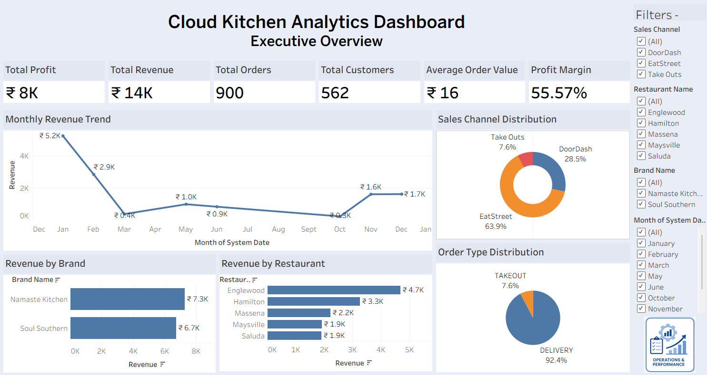
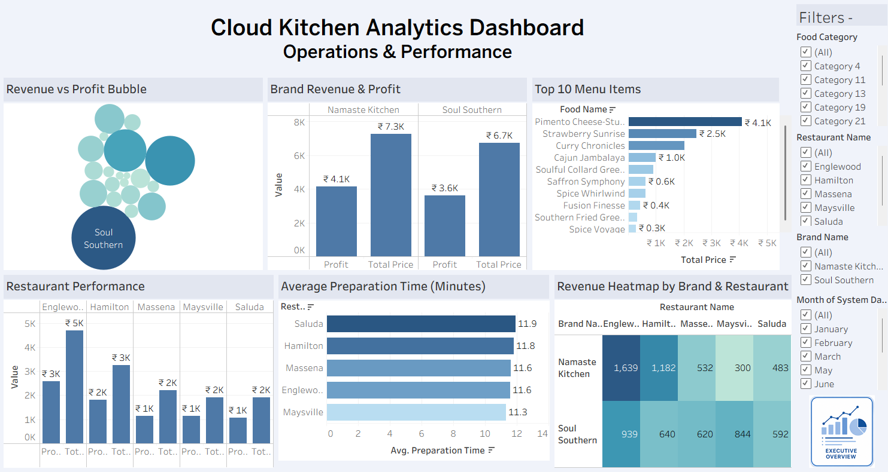

# Cloud Kitchen Performance Analytics Dashboard

## Overview

The **Cloud Kitchen Performance Analytics Project** is an end-to-end Business Intelligence solution developed using a multi-brand cloud kitchen sales dataset. The project focuses on analyzing business performance, restaurant operations, profitability, menu performance, and sales trends through interactive Tableau dashboards.

The project demonstrates the complete analytics workflow—from data cleaning and SQL-based normalization to business analysis and dashboard development—providing actionable insights for improving operational efficiency and supporting data-driven decision-making.

---

## Problem Statement

Cloud kitchens generate large volumes of transactional and operational data across multiple brands, restaurants, menu items, and sales channels. Without structured analysis, it becomes difficult to monitor profitability, identify high-performing restaurants, optimize menu offerings, and improve overall business performance.

This project addresses these challenges by transforming raw business data into interactive dashboards that support strategic decision-making.

---

## Objectives

- Normalize the raw dataset into a relational database using SQL.
- Analyze sales, profit, and operational performance.
- Identify high-performing brands, restaurants, and menu items.
- Evaluate revenue across different sales channels and order types.
- Build interactive Tableau dashboards for business monitoring and decision-making.
- Generate actionable business insights through SQL and data visualization.

---

## Dataset

**Dataset:** Cloud Kitchen Multi-Brand Food Sales Dataset

The dataset contains transactional and operational information related to:

- Orders
- Customers
- Brands
- Restaurants
- Menu Items
- Sales Channels
- Revenue
- Food Cost
- Profit
- Order Preparation Time

---

## Tools and Technologies

### SQL (MySQL)

- Data cleaning
- Dataset normalization
- Relational database design
- Table creation
- Primary and foreign key relationships
- Joins across multiple tables
- Aggregate functions
- GROUP BY and HAVING
- Common Table Expressions (CTEs)
- Window Functions
- Ranking and analytical queries
- Business KPI generation
- **80+ business SQL queries**

---

### Tableau

- Interactive dashboard development
- Data modeling and relationships
- Calculated Fields
- KPI Cards
- Filters
- Navigation Buttons
- Business Intelligence reporting
- Interactive visualizations

---

## Project Workflow

### 1. Data Collection

Imported the cloud kitchen sales dataset containing customer orders, restaurant information, brands, menu items, and operational data.

### 2. SQL Data Cleaning and Preparation

Performed data preprocessing using SQL by:

- Cleaning inconsistent values
- Removing duplicates
- Validating records
- Preparing datasets for SQL normalization

### 3. SQL Database Design & Normalization

Normalized the raw dataset into multiple relational tables, including:

- Sales Fact
- Customers
- Orders
- Brands
- Kitchen Locations
- Menu Items

Established relationships using primary and foreign keys to reduce redundancy, improve data integrity, and enable efficient querying.

### 4. SQL Business Analysis

Performed extensive SQL analysis, including:

- Revenue analysis
- Profitability analysis
- Restaurant performance
- Brand performance
- Menu analysis
- Sales channel analysis
- Operational KPIs

A total of **80+ business SQL queries** were written to answer key business questions before dashboard development.

### 5. Dashboard Development

Built an interactive Tableau dashboard featuring KPIs, filters, navigation buttons, and multiple visualizations to analyze business performance.

---

# Dashboard Overview

The dashboard consists of **two interactive pages**.

---

## Page 1 – Executive Overview

Provides a high-level summary of business performance.

### KPIs

- Total Revenue
- Total Profit
- Total Orders
- Total Customers
- Average Order Value
- Profit Margin

### Visualizations

- Monthly Revenue Trend
- Revenue by Brand
- Revenue by Restaurant
- Sales Channel Distribution
- Order Type Distribution

### Filters

- Brand
- Restaurant
- Sales Channel
- Date

---

## Page 2 – Operations & Performance

Focuses on operational efficiency and business performance.

### KPIs

- Average Preparation Time
- Total Menu Items
- Total Restaurants
- Total Brands

### Visualizations

- Revenue vs Profit Bubble Chart
- Brand Revenue vs Profit
- Restaurant Performance
- Top Selling Menu Items
- Average Preparation Time Analysis
- Operational Heatmap

### Filters

- Brand
- Restaurant
- Date

---

## Dashboard Preview

---

---

# Business Questions Answered

- Which cloud kitchen brands generate the highest revenue and profit?
- Which restaurants contribute the most to overall business performance?
- Which menu items drive the highest sales and profitability?
- How do different sales channels and order types impact revenue?
- What operational trends can be identified to improve business performance?

---

# Key Business Insights

- Revenue is concentrated among a few high-performing brands, highlighting opportunities for targeted business expansion.
- Certain restaurants consistently outperform others in both revenue and profitability.
- A small group of menu items contributes significantly to total sales, supporting menu optimization decisions.
- Sales channel performance varies, indicating opportunities to improve marketing and delivery strategies.
- Preparation time analysis helps identify operational bottlenecks and improve kitchen efficiency.

---

# Features

- Interactive Tableau dashboards
- SQL-normalized relational database
- Dynamic filters
- KPI reporting
- Revenue and profitability analysis
- Restaurant performance tracking
- Brand performance analysis
- Menu performance analysis
- Operational performance monitoring
- Interactive navigation between dashboards

---

# Skills Demonstrated

- Data Cleaning
- Data Preprocessing
- SQL Database Design
- Database Normalization
- Relational Data Modeling
- SQL Querying
- Window Functions
- Data Analysis
- Business Intelligence
- Tableau Dashboard Development
- Calculated Fields
- KPI Development
- Interactive Dashboard Design
- Data Visualization
- Business Insights Generation

---

# Future Enhancements

- Customer Segmentation Analysis
- Sales Forecasting
- Real-time Business Monitoring

---

## Author

**Pranjali Sus**

Aspiring Data Analyst | Business Intelligence | Power BI | SQL | Python

---

## ⭐ If you found this project useful, consider giving this repository a star!

---

## If you found this project useful, consider giving this repository a star!
